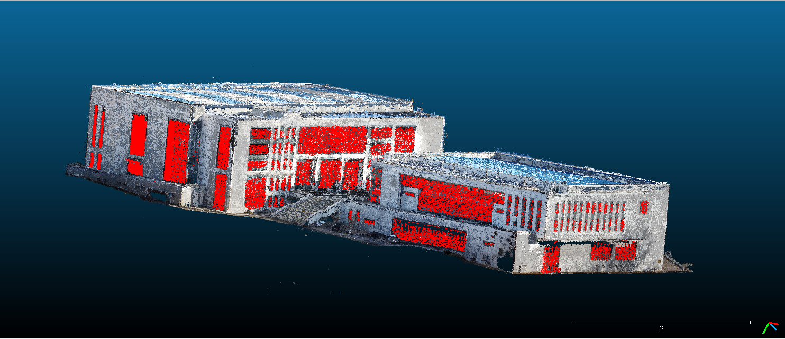
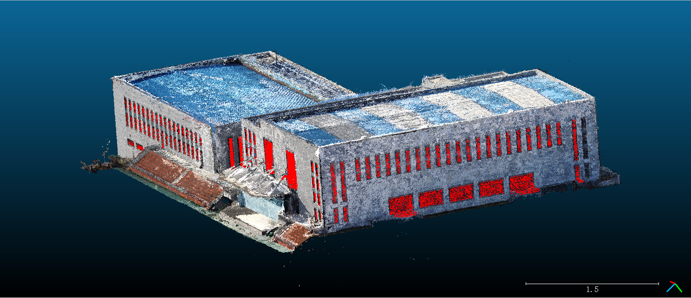

## Part II 基于计算机视觉方法的点云到点云窗户识别

### 1. 窗户识别

对于窗户的识别，我们给出了一种类端到端的过程，完整的实现了从点云到点云的识别过程。具体框架如下

<center></center>


拿到我们第一问的点云输出结果后，我们首先进行投影变换，将点云中建筑的前后左右四个面做投影，再利用图像处理技术将投影图处理成边缘图像，再进行窗户识别，最后将识别的结果通过投影的逆过程映射回点云，并输出我们想要的结果。

#### 1.1 投影

正是由于投影图的像素与点云中的点团是一一对应的关系，使用投影图处理比使用采集的图片处理会有极高的优势。首先，使用投影图可以保证窗户无畸变，其次使用投影图可以将识别到的结果映射回点云，形成一个完整的回路。

##### 1.1.1 计算法向量

```bash
python getNorms.py
```

原理：使用Open3d内置函数计算法向量。

输入：重建好的点云，六列（X, Y, Z, R, G, B）

输出：计算法向量后的点云，九列（X, Y, Z, R, G, B, Nx, Ny, Nz）


##### 1.1.2 投影

```bash
python 3dTo2dTransform.py
```

原理：以xoy平面为例，根据平面法向量调整z轴与之平行，之后将所有点投射至xoy平面，即暂时丢弃z坐标数据，然后在xoy平面上以固定步长（我们设置为0.005）划分网格，每个格子作为生成图像的一个像素点。每个格子取内部点的RGB均值作为像素点的RGB值。其他平面类似，得到投影图。

输入：计算法向量后的点云，九列（X, Y, Z, R, G, B, Nx, Ny, Nz）

输出：4张投影图


#### 1.2 图像处理和边缘检测

##### 1.2.1 中值滤波

```bash
python Completion.py
```

原理：中位数滤波，其是一种非线性平滑技术，可以将每一像素点的像素值设置为该点某邻域窗口内的所有像素点像素的中值。

输入：投影图

输出：补全后的投影图


##### 1.2.2 窗户识别

```bash
python identify windows.py
```

原理：首先二值化处理，通过阈值设置，将大于某值的点置为黑色，否则为白色，二值化之后仍存在较多杂点。下一步进行除杂，除杂思路如下：根据一个点A的RGB值，与周围的8个点的RBG值比较，设定一个值N（0<N<8），当A的RGB值与周围8个点的RGB相等数小于N时，此点为噪点。将噪点置为黑色，这样会得到一张相对清晰的二值化图片。但为了达到更清晰的效果，我们中间叠加了一层中位数滤波器和高斯滤波器。通过Canny算子，我们可以得到相对较完整的边缘图像，得到框架之后我们利用OpenCV内置函数进行多边形拟合，通过三个条件对拟合的多边形进行筛选：①边数大于等于4 ②图形为凸多边形 ③矩形面积不过大过小。至此，我们得到了满足条件的矩形，几乎可以完美识别点云中的所有窗户。

输入：补全后投影图

输出：识别窗户后窗户图


#### 1.3 逆投影

```bash
python drawWindows.py
```

原理：将识别出的窗户二值化图像保留，其他部分置空。可以将像素逆映射到点云中以步长的平方倍的点团中，将这部分点团修改成我们想要的颜色。

输入：二值化窗户图像

输出：识别的窗户为红色的点云


### 2. 点云到真实物体比例尺度

由于点云生成坐标系依赖于相机参数，我们重建出的点云往往不同于真实尺度，而是存在一个定值的比例关系，这也就需要我们寻找合适的坐标系计算比例参数。我们实地选取了多个物体（如窗户、花坛等）与点云坐标做比，具体结果如下：

| 物体         | 真实值       | 点云值     | 体育馆比例系数                  |
| ------------ | ------------ | ---------- | ------------------------------- |
| 窗户1        | 11.82475㎡   | 0.02275    | 519.769 = 22.798^2^             |
| 窗户2        | 11.82475m^2^ | 0.02589832 | 456.5836702921271 = 21.36781^2^ |
| 窗户3        | 16.61195m^2^ | 0.033825   | 491.1145602365115= 22.16^2^     |
| 花坛长度     | 4.825m       | 0.22       | 21.93181                        |
| 最终加权比例 | /            | /          | 22.064405                       |


| 物体         | 真实值     | 点云值    | 东北亚比例系数 |
| ------------ | ---------- | --------- | -------------- |
| 窗户1        | 1.675m     | 0.135     | 12.41          |
| 窗户2        | 3.5136m^2^ | 0.02625   | 11.57          |
| 空调3        | 5.58m^2^   | 95*0.005  | 11.75          |
| 台阶长度     | 6.685m     | 111*0.005 | 12.0           |
| 最终加权比例 | /          | /         | 11.9325        |

得到比例后我们就可以通过OpenCV内置的函数计算出拟合的多边形的面积，通过我们之前选取的步长可以计算出点云中窗户的面积，即投影像素值 * 步长^2^ * 比例系数^2^。可以识别到窗户的行数我们也可以通过程序计算楼层数目。


### 3. 建筑物体积、长宽高计算

#### 3.1 体积计算

```bash
python getVolume.py
```

原理：受到数学中积分方法的启发，我们基于**积分**的思维进行近似的计算。首先，基于地面方向调整点云图，使地面垂直于某一坐标轴以方便计算。然后在水平面方向上对点云沿某一水平坐标轴切片，确保步长足够小。之后对每一个切片，将最低点设为建筑地面基准（因为即便外部存在坡度，建筑内部仍然是水平的），沿另一水平坐标轴方向按步长计算“矩形”面积，“矩形”的高为矩形区域点的垂直坐标和地面基准垂直坐标之差，宽为步长。这样一来，计算切片面积后便可以类似地求出建筑物体积。

输入：要计算体积的点云和地面点云

输出：要计算部分的体积


#### 3.2 长宽高计算

```bash
python lengths.py
```

原理：根据法向量找到同一平面，计算极值的差值。

输入：要计算长度的点云

输出：要计算部分的长宽高


### 4. 结果

#### 4.1 数值结果

|                 | 南馆                                  | 北馆                                  | 体育馆总                           | 东北亚学院                    |
| --------------- | ------------------------------------- | ------------------------------------- | ---------------------------------- | ----------------------------- |
| 长(m)           | 68.94                                 | 83.88                                 | 68.94+83.88                        | 90.21                         |
| 宽(m)           | 55.45                                 | 50.39                                 | 55.45+59.39                        | 24.10                         |
| 高(m)           | 24.66                                 | 28.28                                 | 29.34+28.28                        | 28.10                         |
| 体积($m^3$)     | 59844.31                              | 77142.45                              | 136986.76<br />(59844.31+77142.45) | 24958.36                      |
| 窗户面积($m^2$) | 1016.8<br />(163.9+191.7+186.0+475.2) | 1402.5<br />(147.2+364.9+559.6+330.8) | 2419.3<br />(1016.8+1402.5)        | 548.4<br />(34.6+280.6+233.2) |
| 窗户数量        | 95<br />(40+11+28+16)                 | 113<br />(20+34+49+10)                | 208<br />(95+113)                  | 204<br />(6+76+122)           |
| 楼层数目        | 3                                     | 5                                     | 3/5                                | 3/5/6                         |


#### 4.2 识别窗户后的点云效果

##### 体育馆南北馆

<center></center>

<center></center>


##### 东北亚学院

<center></center>

<center></center>

