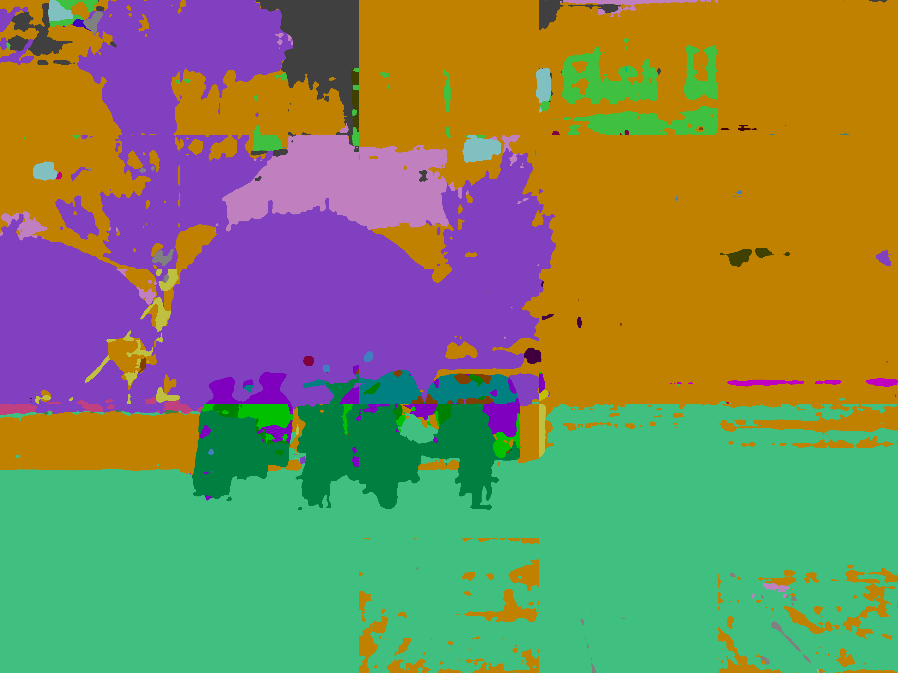
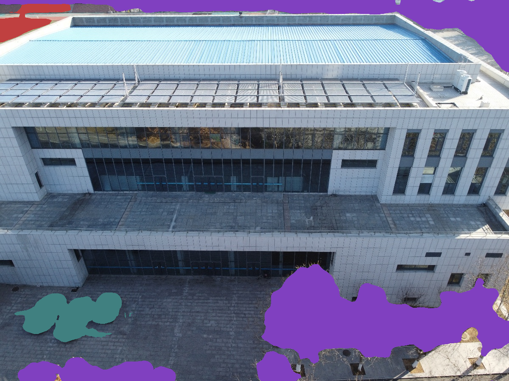
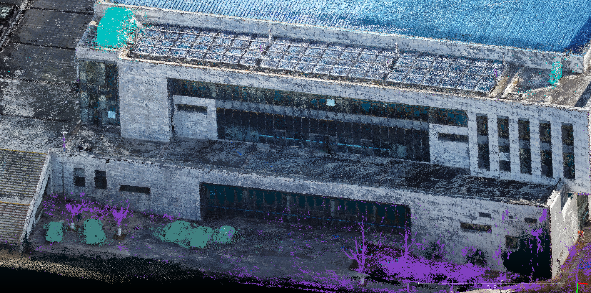

## Part III 基于ResNest的图像到点云的语义分割

### 1 ResNeSt

我们利用ResNeSt-269对二维图片进行语义分割，将结果投射至三维点云。

#### 1.1 简介

Split-attention blocks构造的ResNeSt，与现有的ResNet变体相比，不需要增加额外的计算量。而且ResNeSt可以作为其它任务的骨架。

利用ResNeSt主干的模型能够在几个任务上达到最先进的性能，即图像分类，对象检测，实例分割和语义分割。 与通过神经架构搜索生成的最新CNN模型相比，所提出的ResNeSt性能优于所有现有ResNet变体，并且具有相同的计算效率，甚至可以实现更好的速度精度折衷。单个Cascade-RCNN使用ResNeSt-101主干的模型在MS-COCO实例分割上实现了$48.3％$的box mAP和$41.56％$的mask mAP。 单个DeepLabV3模型同样使用ResNeSt-101主干，在ADE20K场景分析验证集上的mIoU达到$46.9％$，比以前的最佳结果高出$1％$mIoU以上。

ResNeSt在速度与准确度的权衡之下，用于ImageNet dataset 影像分类的表现比其他模型更优秀。此外，在目标检测、实例分割、语义分割上将backbone 替换为ResNeSt也得到了更高的mAP。由于ResNeSt269的高效性，我们将采用ResNeSt269对我们的图片进行语义分割。

#### 1.2 ResNeSt模型架构

网络首先将输入分为 $k$ 个Cardinal Groups，这边的Cardinal是指分组的数量。每个Cardinal Groups又分为 $r$ 个radis，其中 $k$ 和 $r$ 都是超参数。

接着各个 $r$ radis的子特征图会先经过 $1 \times 1, \ 3 \times 3$ 卷积层，再进行Split-Attention，最后再将 $k$ 个分组的输出拼接后与原输入做shortcut connection。

而Split-Attention操作是将各个输入拼接起来做global pooling，再接上两个全连接层后进行softmax，得到的输出与相对应的原输入相乘，最后再进行相加融合。

### 2. 识别过程

我们首先选取用于识别的图片。为保证图片——点云映射关系，我们采用用于生成点云的图片文件。这些图片附有相机参数、关键点数据，可以根据图片上的关键点的label，对在点云上的对应点赋予label。

模型输出结果经处理后，可以将识别的像素按类别标记为不同的颜色，存储为图片格式。在这一步，为提升较小物体（如空调外机）的识别效果，我们采取将图片切割成小块进行识别的策略。

对于这一结果我们继续进行筛选处理，将所需要的类别保留，删去例如天空、建筑等的其它类别。如果存在较为严重的识别失真，我们会针对部分结果进行人工干预。最后，将每张图片上的关键点进行标签匹配，再投射回点云图，我们就得到了最终结果。

### 3. 结果

#### 3.1 东北亚学院

##### 二维语义分割结果（切块并拼接）

##### 筛选label后的结果

##### 点云语义分割结果

#### 3.2 体育馆

##### 二维语义分割结果

##### 筛选label后的结果

##### 点云语义分割结果

