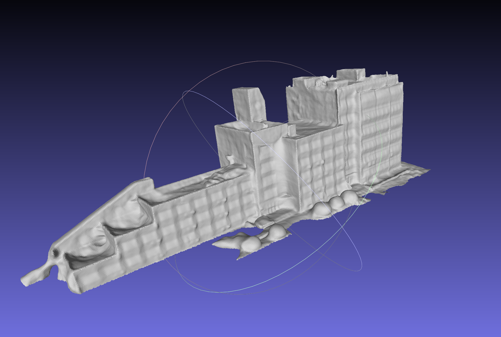
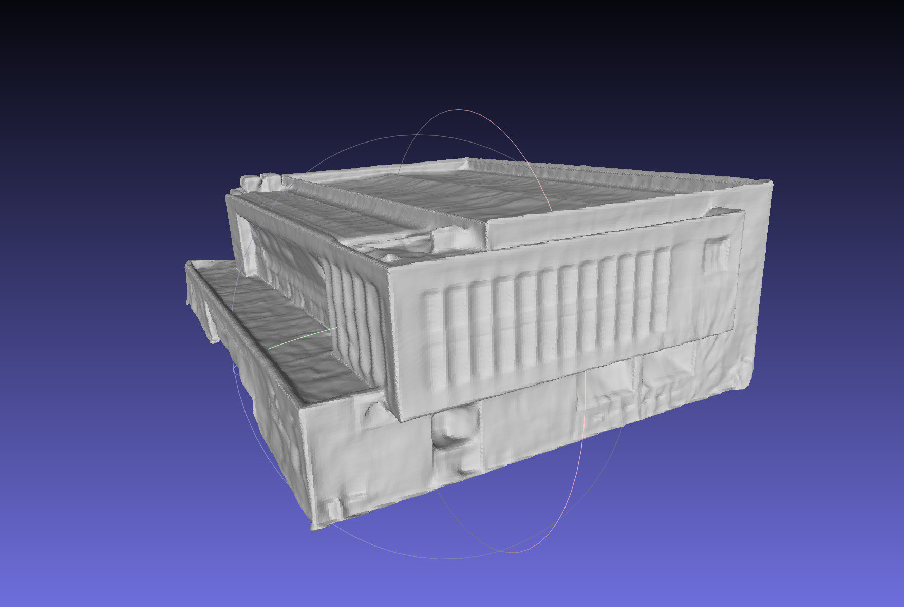

# Part IV NeuS

## 环境部署

安装预处理所需环境，安装colmap。

```
sudo apt-get install \
    git \
    cmake \
    build-essential \
    libboost-program-options-dev \
    libboost-filesystem-dev \
    libboost-graph-dev \
    libboost-regex-dev \
    libboost-system-dev \
    libboost-test-dev \
    libeigen3-dev \
    libsuitesparse-dev \
    libfreeimage-dev \
    libgoogle-glog-dev \
    libgflags-dev \
    libglew-dev \
    qtbase5-dev \
    libqt5opengl5-dev \
    libcgal-dev \
    libcgal-qt5-dev
sudo apt-get install libatlas-base-dev libsuitesparse-dev
git clone https://ceres-solver.googlesource.com/ceres-solver
cd ceres-solver
git checkout $(git describe --tags) # Checkout the latest release
mkdir build
cd build
cmake .. -DBUILD_TESTING=OFF -DBUILD_EXAMPLES=OFF
make
sudo make install
git clone https://github.com/colmap/colmap
cd colmap
git checkout dev
mkdir build
cd build
cmake ..
make
sudo make install
CC=/usr/bin/gcc-6 CXX=/usr/bin/g++-6 cmake ..
```


## 数据预处理

根据[NeuS中的提示](https://github.com/Totoro97/NeuS/tree/main/preprocess_custom_data)将输入图像处理成如下格式。

```
<case_name>
|-- cameras_xxx.npz    # camera parameters
|-- image
    |-- 000.png        # target image for each view
    |-- 001.png
    ...
|-- mask
    |-- 000.png        # target mask each view (For unmasked setting, set all pixels as 255)
    |-- 001.png
    ...
```

首先将NeuS仓库克隆，安装所需库。

```
git clone https://github.com/Totoro97/NeuS.git
cd NeuS
pip install -r requirements.txt
```

下面进行图像到位姿的处理：

```
import os
os.chdir("/content/drive/MyDrive/NeuS/preprocess_custom_data/colmap_preprocess")
python imgs2poses.py /content/drive/MyDrive/NeuS/our_data/
```

将输出的sparse_points.ply做除杂、切割等操作，并储存为sparse_points_interest.ply。

接下来执行

```
python gen_cameras.py /content/drive/MyDrive/NeuS/our_data/
```

在./prepocessed目录下为预处理后结果。


## 训练

### 有mask的训练

```
python exp_runner.py --mode train --conf ./confs/wmask.conf --case our_data
```

### 无mask的训练

```
python exp_runner.py --mode train --conf ./confs/womask.conf --case our_data
```

默认训练300000 iterations，每5000 iterations输出一次结果，150张输入图像使用单张Tesla V100训练时间在10小时左右。


## 提取表面

在训练结束后执行

```
python exp_runner.py --mode validate_mesh --conf ./confs/womask.conf --case our_data --is_continue 
```

默认使用最后一次生成的点云做表面提取，输出结果为最终结果。


## 结果展示

<center></center>

<center></center>


## 参考文献

**NeuS** [[arXiv]](https://arxiv.org/abs/2106.10689) [[PDF]](https://github.com/HMTCuro/3D-Reconstruction/blob/main/References/NeuS.pdf)

Wang P, Liu L, Liu Y, et al. Neus: Learning neural implicit surfaces by volume rendering for multi-view reconstruction[J]. arXiv preprint arXiv:2106.10689, 2021.

