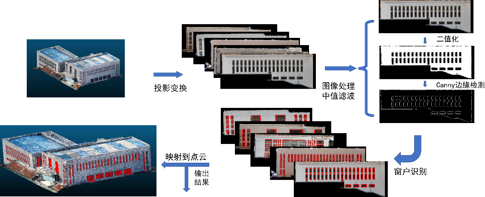

# 基于深度学习方法的单目多视图三维重建

## Part I 三维重建

技术文档：[Markdown](https://github.com/HMTCuro/3D-Reconstruction/blob/main/%E9%A1%B9%E7%9B%AE%E6%96%87%E6%A1%A3/Part1.md) [PDF](https://github.com/HMTCuro/3D-Reconstruction/blob/main/%E9%A1%B9%E7%9B%AE%E6%96%87%E6%A1%A3/Part1.pdf)

## Part II 基于计算机视觉方法的点云到点云窗户识别

技术文档：[Markdown](https://github.com/HMTCuro/3D-Reconstruction/blob/main/%E9%A1%B9%E7%9B%AE%E6%96%87%E6%A1%A3/Part2.md) [PDF](https://github.com/HMTCuro/3D-Reconstruction/blob/main/%E9%A1%B9%E7%9B%AE%E6%96%87%E6%A1%A3/Part2.pdf)

## Part III 基于ResNest的图像到点云的语义分割

技术文档：[Markdown](https://github.com/HMTCuro/3D-Reconstruction/blob/main/%E9%A1%B9%E7%9B%AE%E6%96%87%E6%A1%A3/Part3.md) [PDF](https://github.com/HMTCuro/3D-Reconstruction/blob/main/%E9%A1%B9%E7%9B%AE%E6%96%87%E6%A1%A3/Part3.pdf)

## 参考文献

**AA-RMVSNet** [[arXiv]](https://arxiv.org/abs/2108.03824) [[CVF]](http://openaccess.thecvf.com/content/ICCV2021/html/Wei_AA-RMVSNet_Adaptive_Aggregation_Recurrent_Multi-View_Stereo_Network_ICCV_2021_paper.html) [[PDF]](https://github.com/HMTCuro/3D-Reconstruction/blob/main/References/AA-RMVSNet.pdf)

Wei Z, Zhu Q, Min C, et al. Aa-rmvsnet: Adaptive aggregation recurrent multi-view stereo network[C]//Proceedings of the IEEE/CVF International Conference on Computer Vision. 2021: 6187-6196.

**Cascade-MVSNet** [[arXiv]](http://arxiv.org/abs/1912.06378) [[CVF]](https://openaccess.thecvf.com/content_CVPR_2020/html/Gu_Cascade_Cost_Volume_for_High-Resolution_Multi-View_Stereo_and_Stereo_Matching_CVPR_2020_paper.html) [[PDF]](https://github.com/HMTCuro/3D-Reconstruction/blob/main/References/Cascade-MVSNet.pdf)

Gu X, Fan Z, Zhu S, et al. Cascade cost volume for high-resolution multi-view stereo and stereo matching[C]//Proceedings of the IEEE/CVF Conference on Computer Vision and Pattern Recognition. 2020: 2495-2504.

**TransMVSNet** [[arXiv]](http://arxiv.org/abs/2111.14600) [[PDF]](https://github.com/HMTCuro/3D-Reconstruction/blob/main/References/TransMVSNet.pdf)

Ding Y, Yuan W, Zhu Q, et al. TransMVSNet: Global Context-aware Multi-view Stereo Network with Transformers[J]. arXiv preprint arXiv:2111.14600, 2021.

**LoFTR** [[arXiv]](http://arxiv.org/abs/2104.00680) [[CVF]](https://openaccess.thecvf.com/content/CVPR2021/html/Sun_LoFTR_Detector-Free_Local_Feature_Matching_With_Transformers_CVPR_2021_paper.html) [[PDF]](https://github.com/HMTCuro/3D-Reconstruction/blob/main/References/LoFTR.pdf)

Sun J, Shen Z, Wang Y, et al. LoFTR: Detector-free local feature matching with transformers[C]//Proceedings of the IEEE/CVF Conference on Computer Vision and Pattern Recognition. 2021: 8922-8931.

**PatchmatchNet** [[arXiv]](http://arxiv.org/abs/2012.01411) [[CVF]](https://openaccess.thecvf.com/content/CVPR2021/html/Wang_PatchmatchNet_Learned_Multi-View_Patchmatch_Stereo_CVPR_2021_paper.html) [[PDF]](https://github.com/HMTCuro/3D-Reconstruction/blob/main/References/PatchmatchNet.pdf)

Wang F, Galliani S, Vogel C, et al. PatchmatchNet: Learned Multi-View Patchmatch Stereo[C]//Proceedings of the IEEE/CVF Conference on Computer Vision and Pattern Recognition. 2021: 14194-14203.

**ResNeSt** [[arXiv]](http://arxiv.org/abs/2004.08955) [[PDF]](https://github.com/HMTCuro/3D-Reconstruction/blob/main/References/ResNeSt.pdf)

Zhang H, Wu C, Zhang Z, et al. Resnest: Split-attention networks[J]. arXiv preprint arXiv:2004.08955, 2020.

## 致谢

稀疏重建部分使用[Colmap](https://github.com/colmap/colmap)完成相机参数的获取。

稠密重建部分的代码主要来源于[AA-RMVSNet](https://github.com/QT-Zhu/AA-RMVSNet)。

点云切割与可视化使用[CloudCompare](https://github.com/CloudCompare/CloudCompare)及[Meshlab](https://github.com/cnr-isti-vclab/meshlab)完成。

表面重建调用了[Open3D](https://github.com/isl-org/Open3D)。

Cascade+Transformer的代码主要基于[kwea123](https://github.com/kwea123)实现的[pytorch-lightning](https://github.com/PyTorchLightning/pytorch-lightning)版本的[Cascade-MVSNetl](https://github.com/kwea123/CasMVSNet_pl)以及[LoFTR](https://github.com/zju3dv/LoFTR)进行实现。

语义分割部分调用了[PyTorch-Encoding](https://github.com/zhanghang1989/PyTorch-Encoding)。
