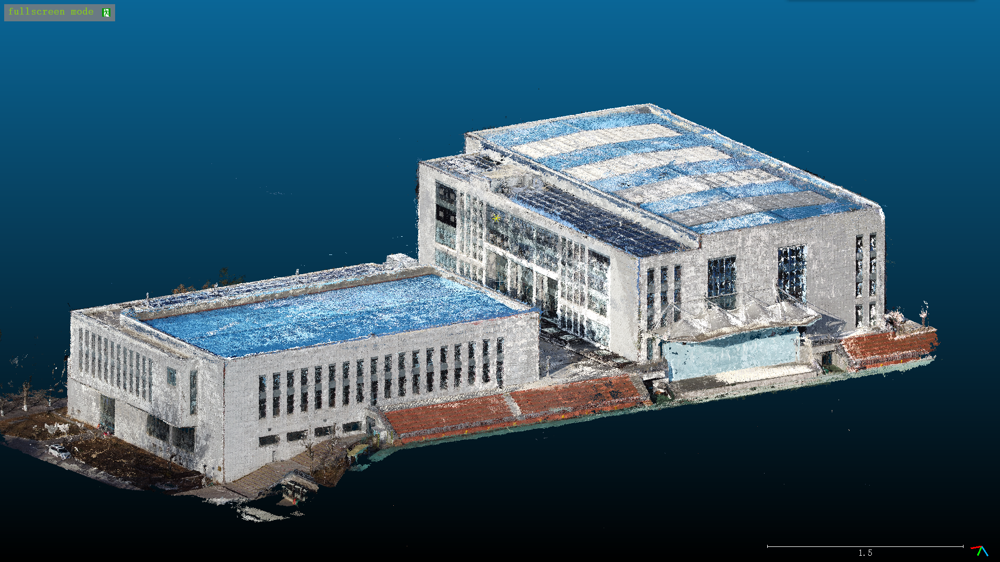
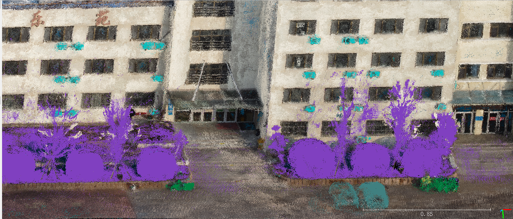
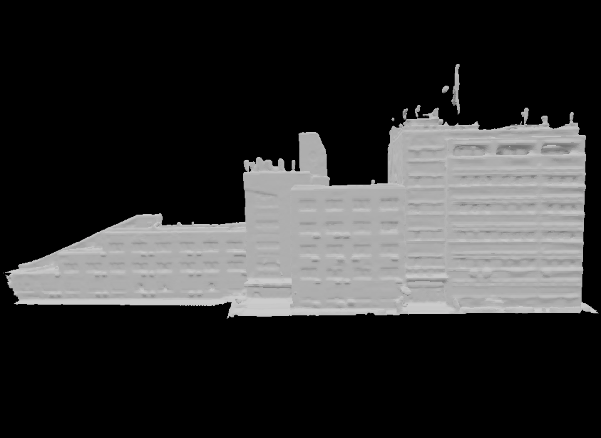
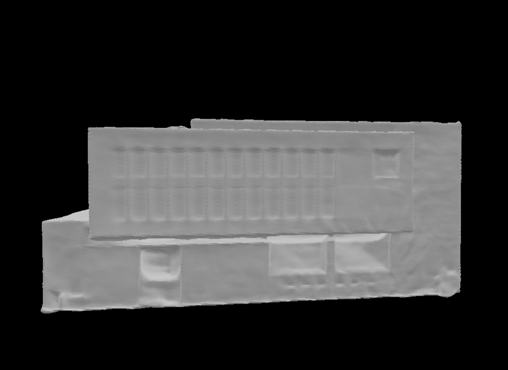
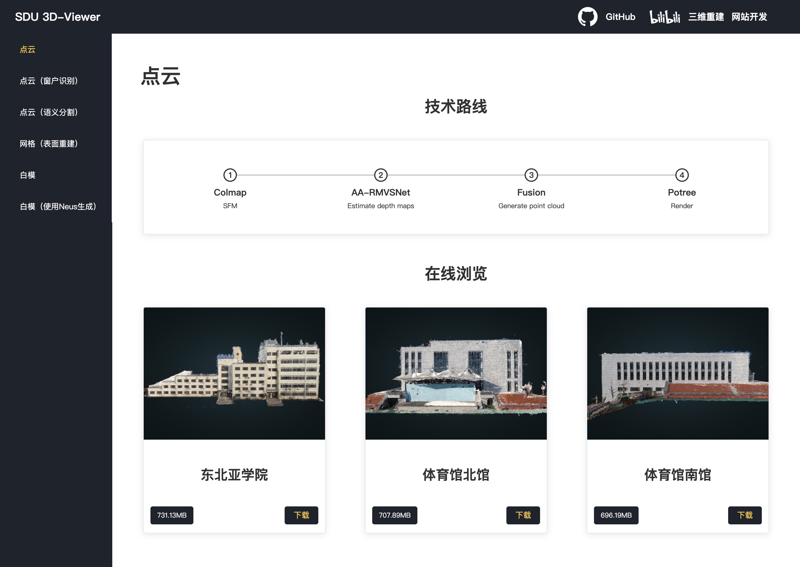

# 基于深度学习方法的单目多视图三维重建

## Part I 三维重建

**代码**：[Part I - Multi View Stereo](https://github.com/HMTCuro/3D-Reconstruction/tree/main/PartI%20-%20Multi%20View%20Stereo)

**技术文档**：[[Markdown]](https://github.com/HMTCuro/3D-Reconstruction/blob/main/Documentation/Part1.md) [[PDF]](https://github.com/HMTCuro/3D-Reconstruction/blob/main/Documentation/Part1.pdf)

**原始图像**：[Original Images](https://github.com/HMTCuro/3D-Reconstruction/releases/tag/5)

**点云结果**：[Point Cloud Results-1](https://github.com/HMTCuro/3D-Reconstruction/releases/tag/1)

**效果图**：

## Part II 基于计算机视觉方法的点云到点云窗户识别

**代码**：[Part II - Window Detection](https://github.com/HMTCuro/3D-Reconstruction/tree/main/Part%20II%20-%20Window%20Detection)

**技术文档**：[[Markdown]](https://github.com/HMTCuro/3D-Reconstruction/blob/main/Documentation/Part2.md) [[PDF]](https://github.com/HMTCuro/3D-Reconstruction/blob/main/Documentation/Part2.pdf)

**点云结果**：[Point Cloud Results-2](https://github.com/HMTCuro/3D-Reconstruction/releases/tag/2)

**算法流程图**：

## Part III 基于ResNest的图像到点云的语义分割

**代码**：[Part III - Semantic Segmentation](https://github.com/HMTCuro/3D-Reconstruction/tree/main/Part%20III%20-%20Semantic%20Segmentation)

**技术文档**：[[Markdown]](https://github.com/HMTCuro/3D-Reconstruction/blob/main/Documentation/Part3.md) [[PDF]](https://github.com/HMTCuro/3D-Reconstruction/blob/main/Documentation/Part3.pdf)

**语义分割结果**：[Semantic Segmentation Results](https://github.com/HMTCuro/3D-Reconstruction/releases/tag/4)

**点云结果**：[Point Cloud Results-3](https://github.com/HMTCuro/3D-Reconstruction/releases/tag/3)

**效果图**：

## Part IV 白模生成

**代码**：[Part IV - NeuS](https://github.com/HMTCuro/3D-Reconstruction/tree/main/Part%20IV%20-%20NeuS)

**技术文档**：[[Markdown]](https://github.com/HMTCuro/3D-Reconstruction/blob/main/Documentation/Part4.md) [[PDF]](https://github.com/HMTCuro/3D-Reconstruction/blob/main/Documentation/Part4.pdf)

**白模结果（Colmap+Meshlab）**：[White Mesh](https://github.com/HMTCuro/3D-Reconstruction/releases/tag/6)

**白模结果（NeuS）**：[White Mesh (NeuS)](https://github.com/HMTCuro/3D-Reconstruction/releases/tag/7)

**效果图（Colmap+Meshlab）**：

**效果图（NeuS）**：

## Part V 网站开发

**代码**：[Part V - Frontend](https://github.com/HMTCuro/3D-Reconstruction/tree/main/Part%20V%20-%20Frontend)

**技术文档**：[[Markdown]](https://github.com/HMTCuro/3D-Reconstruction/blob/main/Documentation/Part5.md) [[PDF]](https://github.com/HMTCuro/3D-Reconstruction/blob/main/Documentation/Part5.pdf)

**网站链接**：[SDU 3D-Viewer](182.)

**预览图**：

## 参考文献

**AA-RMVSNet** [[arXiv]](https://arxiv.org/abs/2108.03824) [[CVF]](http://openaccess.thecvf.com/content/ICCV2021/html/Wei_AA-RMVSNet_Adaptive_Aggregation_Recurrent_Multi-View_Stereo_Network_ICCV_2021_paper.html) [[PDF]](https://github.com/HMTCuro/3D-Reconstruction/blob/main/References/AA-RMVSNet.pdf)

Wei Z, Zhu Q, Min C, et al. Aa-rmvsnet: Adaptive aggregation recurrent multi-view stereo network[C]//Proceedings of the IEEE/CVF International Conference on Computer Vision. 2021: 6187-6196.

**Cascade-MVSNet** [[arXiv]](http://arxiv.org/abs/1912.06378) [[CVF]](https://openaccess.thecvf.com/content_CVPR_2020/html/Gu_Cascade_Cost_Volume_for_High-Resolution_Multi-View_Stereo_and_Stereo_Matching_CVPR_2020_paper.html) [[PDF]](https://github.com/HMTCuro/3D-Reconstruction/blob/main/References/Cascade-MVSNet.pdf)

Gu X, Fan Z, Zhu S, et al. Cascade cost volume for high-resolution multi-view stereo and stereo matching[C]//Proceedings of the IEEE/CVF Conference on Computer Vision and Pattern Recognition. 2020: 2495-2504.

**TransMVSNet** [[arXiv]](http://arxiv.org/abs/2111.14600) [[PDF]](https://github.com/HMTCuro/3D-Reconstruction/blob/main/References/TransMVSNet.pdf)

Ding Y, Yuan W, Zhu Q, et al. TransMVSNet: Global Context-aware Multi-view Stereo Network with Transformers[J]. arXiv preprint arXiv:2111.14600, 2021.

**LoFTR** [[arXiv]](http://arxiv.org/abs/2104.00680) [[CVF]](https://openaccess.thecvf.com/content/CVPR2021/html/Sun_LoFTR_Detector-Free_Local_Feature_Matching_With_Transformers_CVPR_2021_paper.html) [[PDF]](https://github.com/HMTCuro/3D-Reconstruction/blob/main/References/LoFTR.pdf)

Sun J, Shen Z, Wang Y, et al. LoFTR: Detector-free local feature matching with transformers[C]//Proceedings of the IEEE/CVF Conference on Computer Vision and Pattern Recognition. 2021: 8922-8931.

**PatchmatchNet** [[arXiv]](http://arxiv.org/abs/2012.01411) [[CVF]](https://openaccess.thecvf.com/content/CVPR2021/html/Wang_PatchmatchNet_Learned_Multi-View_Patchmatch_Stereo_CVPR_2021_paper.html) [[PDF]](https://github.com/HMTCuro/3D-Reconstruction/blob/main/References/PatchmatchNet.pdf)

Wang F, Galliani S, Vogel C, et al. PatchmatchNet: Learned Multi-View Patchmatch Stereo[C]//Proceedings of the IEEE/CVF Conference on Computer Vision and Pattern Recognition. 2021: 14194-14203.

**ResNeSt** [[arXiv]](http://arxiv.org/abs/2004.08955) [[PDF]](https://github.com/HMTCuro/3D-Reconstruction/blob/main/References/ResNeSt.pdf)

Zhang H, Wu C, Zhang Z, et al. Resnest: Split-attention networks[J]. arXiv preprint arXiv:2004.08955, 2020.

**NeuS** [[arXiv]](https://arxiv.org/abs/2106.10689) [[PDF]](https://github.com/HMTCuro/3D-Reconstruction/blob/main/References/NeuS.pdf)

Wang P, Liu L, Liu Y, et al. Neus: Learning neural implicit surfaces by volume rendering for multi-view reconstruction[J]. arXiv preprint arXiv:2106.10689, 2021.

## 致谢

稀疏重建部分使用[Colmap](https://github.com/colmap/colmap)完成相机参数的获取。

稠密重建部分的代码主要来源于[AA-RMVSNet](https://github.com/QT-Zhu/AA-RMVSNet)。

点云切割与可视化使用[CloudCompare](https://github.com/CloudCompare/CloudCompare)及[Meshlab](https://github.com/cnr-isti-vclab/meshlab)完成。

调用[Open3D](https://github.com/isl-org/Open3D)进行表面重建。

Cascade+Transformer的代码主要基于[kwea123](https://github.com/kwea123)实现的[pytorch-lightning](https://github.com/PyTorchLightning/pytorch-lightning)版本的[Cascade-MVSNet](https://github.com/kwea123/CasMVSNet_pl)以及[LoFTR](https://github.com/zju3dv/LoFTR)进行实现。

窗户识别算法中部分思路参考了Color Space的[矩形识别算法](https://cloud.tencent.com/developer/article/1675022)，图像处理技术主要基于冈萨雷斯的[数字图像处理（第三版）](https://sg1lib.org/book/5702757/0c5632)。

语义分割部分调用了[PyTorch-Encoding](https://github.com/zhanghang1989/PyTorch-Encoding)。

网站开发使用了[Element-Plus](https://element-plus.gitee.io/zh-CN/)的组件，使用[Potree](https://potree.github.io/index.html)和[Three.js](https://threejs.org/)进行渲染。

白模生成使用了[NeuS](https://github.com/Totoro97/NeuS)的代码进行训练并测试。

