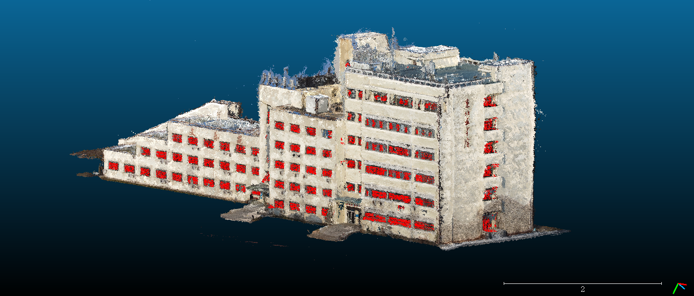
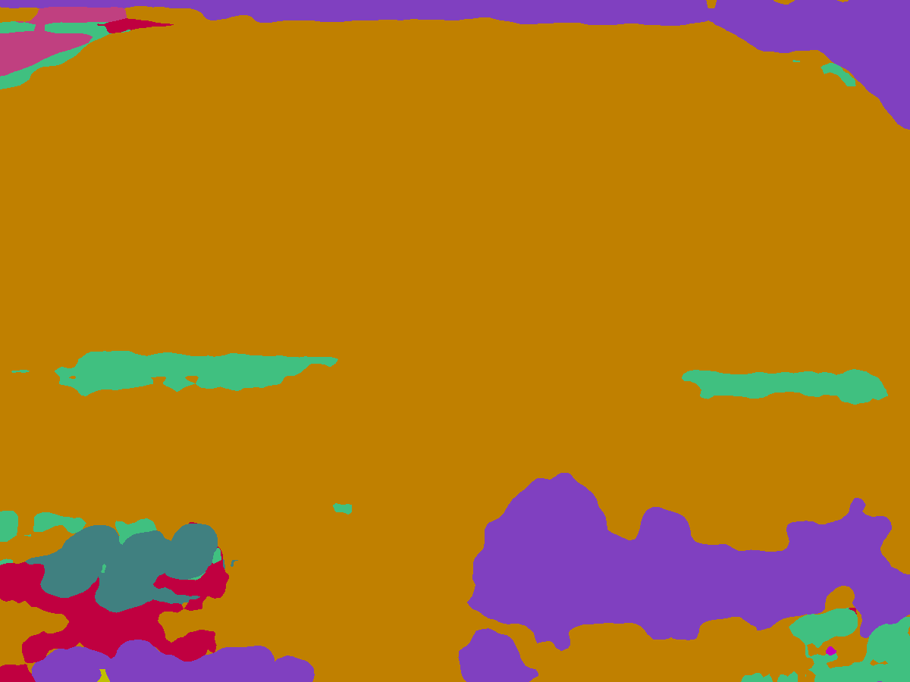
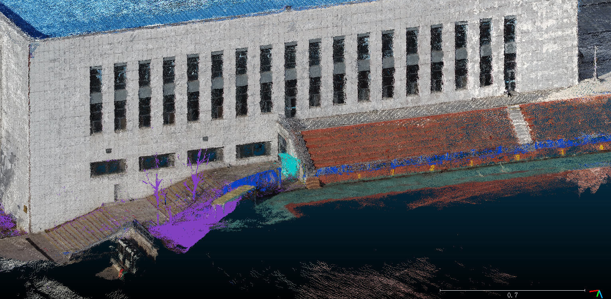

# 基于深度学习方法的单目多视图三维重建

## Part I 三维重建

### 1 稀疏重建 - Colmap

1.打开根目录下COLMAP.bat

2.在GUI中点击上方菜单的Reconstruction，下拉菜单中点击Automatic reconstruction


3.选择Workplace folder作为工作目录。之后的生成结果将保存在这个目录下

4.选择Image folder作为图片目录。该目录存放用于生成点云的图片

5.（可选）如果需要生成稠密重建结果，勾选下方的dense model。这会耗费较多的时间。

6.点击Run。在一段时间后便可得到生成结果，结果存储在Workplace folder下


### 2 格式转换

```bash
python ./AA-RMVSNet/colmap_input.py
```


### 3 微调

使用BlendedMVS数据集进行微调

```bash
./AA-RMVSNet/scripts/train_blend.sh
```


### 4 深度图推理

```bash
./AA-RMVSNet/scripts/eval_gym.sh
./AA-RMVSNet/scripts/eval_dongbeiya.sh
```


### 5 点云生成

原始点云

```bash
./AA-RMVSNet/scripts/fusion_gym.sh
./AA-RMVSNet/scripts/fusion_dongbeiya.sh
```

包含语义分割结果的点云

```bash
./AA-RMVSNet/scripts/fusion_gym_color.sh
./AA-RMVSNet/scripts/fusion_dongbeiya_color.sh
```


### 6 表面重建

#### 6.1 计算法向量

使用python中的Open3d包。对pointcloud类调用方法

```python
self.estimate_normals(search_param=o3d.geometry.KDTreeSearchParamHybrid(radius=0.01, max_nn=100))
```

其中的参数可以不用调整，也可根据实际情况适当改动。计算完成后保存当前点云。

#### 6.2 法向量调整

在CloudCompare中导入经计算的点云。为了保证准确性，建议将点云分小块调整法向量。点击菜单栏Edit-Normals-Orient normals-With minimum spanning tree，按照默认参数（也可以调高）运行。得到结果后保存。

#### 6.3 表面重建

使用python中的Open3d包。

```python
o3d.geometry.TriangleMesh.create_from_point_cloud_poisson(filename, depth=11, width=0, scale=1.1, linear_fit=False)[0]
```

其中width、scale、linear_fit参数可以不用调整。depth参数按需求调整，值取越高越精细。得到表面重建结果后保存。


### 7 点云切割

1.打开CloudCompare

2.左上角点击Open图标，导入点云。


3.选取合适的角度作为切割平面，在左侧的DB Tree选中点云，点击上方切割图标


4.鼠标左键绘制多边形，右键退出绘制。上方窗口菜单点击多边形重新绘制；点击Segment In选取内部；点击Segment Out选取外部；点击确定按钮完成切割。


5.切割之后会在左侧的DB Tree生成两份点云，可以删除其中的一份


6.在左侧的DB Tree选中点云，左上角点击Save图标，保存在某一路径。


## Part II 基于计算机视觉方法的点云到点云窗户识别

### 1 窗户识别

#### 1.1 投影

##### 1.1.1 计算法向量

```bash
python getNorms.py
```

输入：重建好的点云，六列(X,Y,Z,R,G,B)

输出：计算法向量后的点云，九列(X,Y,Z,R,G,B,Nx,Ny,Nz)

原理：使用open3d内置函数计算法向量。

##### 1.1.2 投影

```bash
python 3dTo2dTransform.py
```

输入：计算法向量后的点云，九列(X,Y,Z,R,G,B,Nx,Ny,Nz)

输出：4张投影图

原理：以xoy平面为例，根据平面法向量调整z轴与之平行，之后将所有点投射至xoy平面，即暂时丢弃z坐标数据，然后在xoy平面上以固定步长（我们设置为0.005）划分网格，每个格子作为生成图像的一个像素点。每个格子取内部点的RGB均值作为像素点的RGB值。其他平面类似，得到投影图。


#### 1.2 图像处理和边缘检测

##### 1.2.1 中值滤波

```bash
python Completion.py
```

输入：投影图

输出：补全后投影图

原理：中位数滤波，其是一种非线性平滑技术，它将每一像素点的像素值设置为该点某邻域窗口内的所有像素点像素的中值。

##### 1.2.2 窗户识别

```bash
python identify windows.py
```

输入：补全后投影图

输出：识别窗户后窗户图

原理：首先二值化处理，通过阈值设置，将大于某值的点置为黑色，否则为白色，二值化之后仍存在较多杂点。下一步进行除杂，除杂思路如下：根据一个点A的RGB值，与周围的8个点的RBG值比较，设定一个值N（0 <N <8），当A的RGB值与周围8个点的RGB相等数小于N时，此点为噪点。将噪点置为黑色，这样会得到一张相对清晰的二值化图片。但为了达到更清晰的效果，我们中间叠加了一层中位数滤波器和高斯滤波器。通过Canny算子，我们可以得到相对较完整的边缘图像，得到框架之后我们利用OpenCV内置函数进行多边形拟合，通过三个条件对拟合的多边形进行筛选：①边数大于等于4 ②图形为凸多边形 ③矩形面积不过大过小。至此，我们得到了满足条件的矩形，几乎可以完美识别点云中的所有窗户。


#### 1.3 逆投影

```bash
python drawWindows.py
```

输入：二值化窗户图像

输出：识别的窗户为红色的点云

原理：将识别出的窗户二值化图像保留，其他部分置空。可以将像素逆映射到点云中以步长的平方倍的点团中，将这部分点团修改成我们想要的颜色。


### 2 体积、长度计算

#### 2.1 体积计算

```bash
python getVolume.py
```

输入：要计算体积的点云和地面点云

输出：要计算部分的体积

原理：受到数学中积分方法的启发，我们基于积分的思维进行近似的计算。首先，基于地面方向调整点云图，使地面垂直于某一坐标轴以方便计算。然后在水平面方向上对点云沿某一水平坐标轴切片，确保步长足够小。之后对每一个切片，将最低点设为建筑地面基准（因为即便外部存在坡度，建筑内部仍然是水平的），沿另一水平坐标轴方向按步长计算“矩形”面积，“矩形”的高为矩形区域点的垂直坐标和地面基准垂直坐标之差，宽为步长。这样一来，计算切片面积后便可以类似地求出建筑物体积。


#### 2.2 长度计算

```bash
python lengths.py
```

输入：要计算长度的点云

输出：要计算部分的长宽高

原理：根据法向量找到同一平面，计算极值的差值。


### 3 结果

#### 3.1 数值

|              | 南馆                                  | 北馆                                  | 体育馆总                           | 东北亚学院                    |
| ------------ | ------------------------------------- | ------------------------------------- | ---------------------------------- | ----------------------------- |
| 长(m)        | 68.94                                 | 83.88                                 | 68.94+83.88                        | 90.21                         |
| 宽(m)        | 55.45                                 | 50.39                                 | 55.45+59.39                        | 24.10                         |
| 高(m)        | 24.66                                 | 28.28                                 | 29.34+28.28                        | 28.10                         |
| 体积(m3)     | 59844.31                              | 77142.45                              | 136986.76<br />(59844.31+77142.45) | 24958.36                      |
| 窗户面积(m2) | 1016.8<br />(163.9+191.7+186.0+475.2) | 1402.5<br />(147.2+364.9+559.6+330.8) | 2419.3<br />(1016.8+1402.5)        | 548.4<br />(34.6+280.6+233.2) |
| 窗户数量     | 95<br />(40+11+28+16)                 | 113<br />(20+34+49+10)                | 208<br />(95+113)                  | 204<br />(6+76+122)           |
| 楼层数目     | 3                                     | 5                                     | 3+5                                | 3+5+6                         |


#### 3.2 识别窗户后的点云效果





## Part III 基于ResNest的图像到点云的语义分割

### 1 ResNeSt

我们利用ResNeSt-269对二维图片进行语义分割，将结果投射至三维点云。

#### ResNeSt简介

  split-attention blocks构造的ResNeSt，与现有的ResNet变体相比，不需要增加额外的计算量。而且ResNeSt可以作为其它任务的骨架。

  利用ResNeSt主干的模型能够在几个任务上达到最先进的性能，即图像分类，对象检测，实例分割和语义分割。 与通过神经架构搜索生成的最新CNN模型[55]相比，所提出的ResNeSt性能优于所有现有ResNet变体，并且具有相同的计算效率，甚至可以实现更好的速度精度折衷。单个Cascade-RCNN [3]使用ResNeSt-101主干的模型在MS-COCO实例分割上实现了48.3％的box mAP和41.56％的mask mAP。 单个DeepLabV3 [7]模型同样使用ResNeSt-101主干，在ADE20K场景分析验证集上的mIoU达到46.9％，比以前的最佳结果高出1％mIoU以上。
  
  ResNeSt 在速度与准确度的权衡之下，用于ImageNet dataset 影像分类的表现比其他模型更优秀。此外，在object detection, instance segmentation, semantic segmentation 上将backbone 替换为ResNeSt 也得到了更高的mAP。由于ResNeSt269的高效性，我们将采用ResNeSt269对我们的图片进行语义分割。

#### ResNeSt模型架构

ResNeSt 的网路架构，首先将输入分为k 个Cardinal Groups，这边的Cardinal是指分组的数量。每个Cardinal Groups 又分为r 个radis，其中k 跟r 都是超参数。

接着各个r radis 的子特征图会先经过1x1, 3x3 卷积层，再进行Split-Attention，最后再将k 个分组的输出concat 后与原输入做shortcut connection。

而Split-Attention 操作是将各个输入concat 起来做Global pooling，再接上两个全连接层后进行softmax，得到的输出与相对应的原输入相乘，最后再通通相加融合。

### 2 识别过程

我们首先选取用于识别的图片。为保证图片——点云映射关系，我们采用用于生成点云的图片文件。这些图片附有相机参数、关键点数据，可以根据图片上的关键点的label，对在点云上的对应点赋予label。

模型输出结果经处理后，可以将识别的像素按类别标记为不同的颜色，存储为图片格式。在这一步，为提升较小物体（如空调外机）的识别效果，我们采取将图片切割成小块进行识别的策略。

对于这一结果我们继续进行筛选处理，将所需要的类别保留，删去例如天空、建筑等的其它类别。如果存在较为严重的识别失真，我们会针对部分结果进行人工干预。最后，将每张图片上的关键点进行标签匹配，再投射回点云图，我们就得到了最终结果。

### 3 结果

#### 3.1 东北亚学院

##### 二维语义分割结果（切块并拼接）


##### 筛选label后的结果


##### 点云语义分割结果


#### 3.2 体育馆

##### 二维语义分割结果




##### 筛选label后的结果


##### 点云语义分割结果




