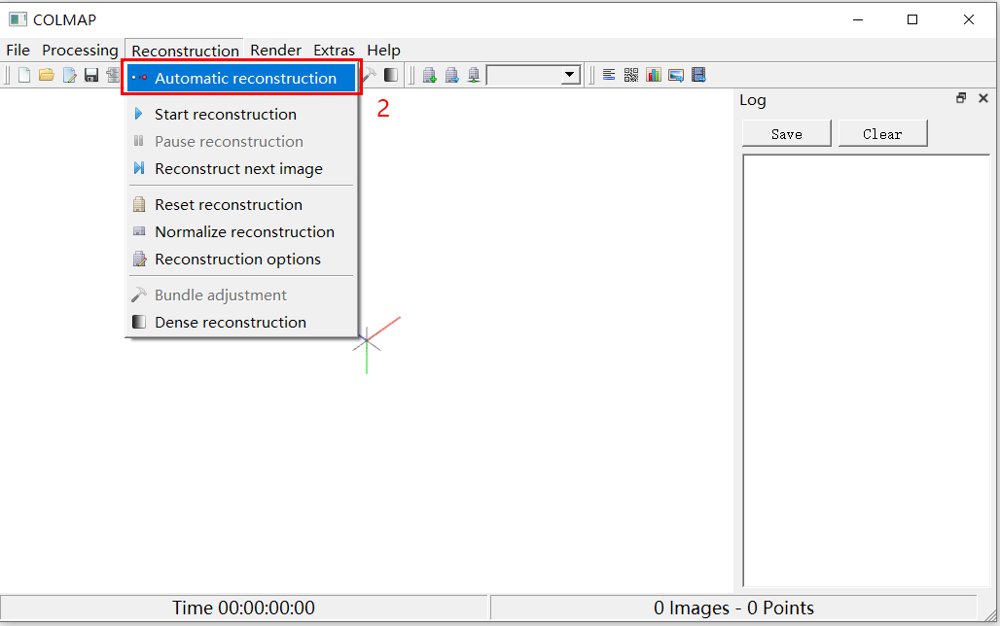
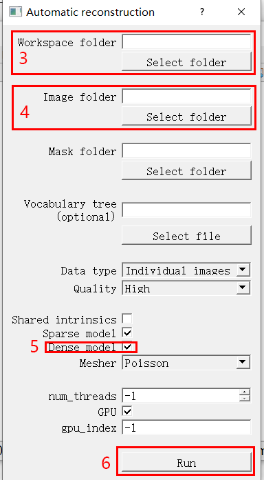
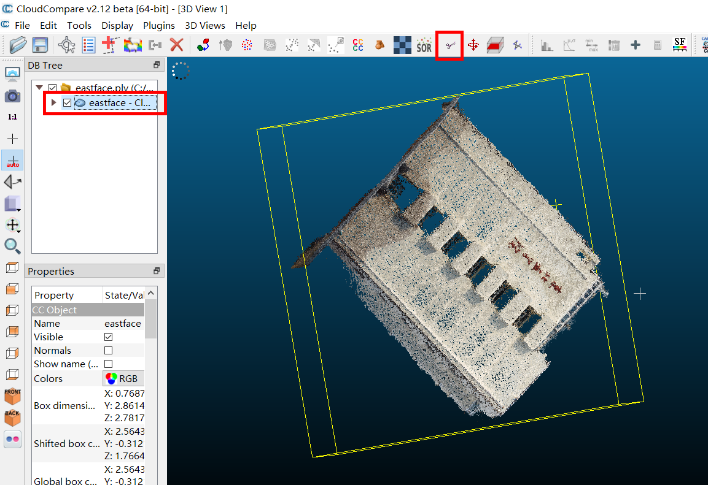

# Part I 深度学习方法三维重建

### 1. 稀疏重建 - Colmap

使用步骤：

1. 打开根目录下COLMAP.bat
2. 在GUI中点击上方菜单的Reconstruction，下拉菜单中点击Automatic reconstruction

<center></center>

3. 选择Workplace folder作为工作目录。之后的生成结果将保存在这个目录下

4. 选择Image folder作为图片目录。该目录存放用于生成点云的图片

5. （可选）如果需要生成稠密重建结果，勾选下方的dense model。这会耗费较多的时间。

6. 点击Run。在一段时间后便可得到生成结果，结果存储在Workplace folder下

<center></center>


### 2. 格式转换

```bash
python ../Part1/AA-RMVSNet/colmap_input.py
```


### 3. 微调

使用[BlendedMVS](https://github.com/YoYo000/BlendedMVS)数据集进行微调（感谢由[MVSNet](https://github.com/YoYo000/MVSNet)提供的BlendedMVS数据集的[下载链接](https://drive.google.com/open?id=1ilxls-VJNvJnB7IaFj7P0ehMPr7ikRCb)）

```bash
../Part1/AA-RMVSNet/scripts/train_blend.sh
```

详细参数设置见脚本文件。


### 4. 深度图推理

```bash
../Part1/AA-RMVSNet/scripts/eval_gym.sh
../Part1/AA-RMVSNet/scripts/eval_dongbeiya.sh
```


### 5. 点云生成

#### 原始点云

```bash
../Part1/AA-RMVSNet/scripts/fusion_gym.sh
../Part1/AA-RMVSNet/scripts/fusion_dongbeiya.sh
```

注：在脚本中需要配置深度图输出的路径


#### 包含语义分割结果的点云

```bash
../Part1/AA-RMVSNet/scripts/fusion_gym_color.sh
../Part1/AA-RMVSNet/scripts/fusion_dongbeiya_color.sh
```

注：在脚本中需要配置深度图输出的路径、二维语义分割结果的路径


### 6. 表面重建

#### 6.1 计算法向量

使用python中的Open3d包，对pointcloud类调用方法：

```python
self.estimate_normals(search_param=o3d.geometry.KDTreeSearchParamHybrid(radius=0.01, max_nn=100))
```

其中的参数可以不用调整，也可根据实际情况适当改动。计算完成后保存当前点云。


#### 6.2 法向量调整

在CloudCompare中导入经计算的点云。为了保证准确性，建议将点云分小块调整法向量。点击菜单栏Edit-Normals-Orient normals-With minimum spanning tree，按照默认参数（也可以调高）运行。得到结果后保存。


#### 6.3 表面重建

使用Open3d中的Poisson表面重建算法。

```python
o3d.geometry.TriangleMesh.create_from_point_cloud_poisson(filename, depth=11, width=0, scale=1.1, linear_fit=False)[0]
```

其中width、scale、linear_fit参数可以不用调整。depth参数按需求调整，值取越高越精细。得到表面重建结果后保存。


### 7. 点云切割

由于生成的点云中包含部分周围其他建筑的残影，需要进行点云切割，将杂点从点云中删除。下面给出使用CloudCompare软件进行点云切割的方法。

1. 打开CloudCompare

2. 点击左上角Open图标，导入点云。

<center></center>


3. 选取合适的角度作为切割平面，在左侧的DB Tree选中点云，点击上方切割图标

<center></center>


4. 鼠标左键绘制多边形，右键退出绘制。上方窗口菜单点击多边形重新绘制；点击Segment In选取内部；点击Segment Out选取外部；点击确定按钮完成切割。

<center></center>


5. 切割之后会在左侧的DB Tree生成两份点云，可以删除其中的一份

<center></center>


<center></center>


6. 在左侧的DB Tree选中点云，左上角点击Save图标，保存在某一路径。

